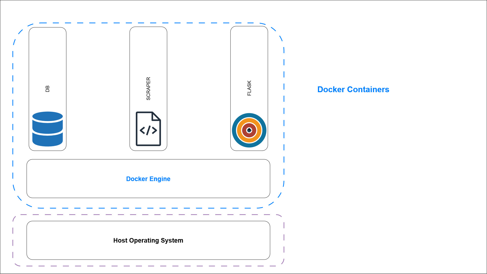
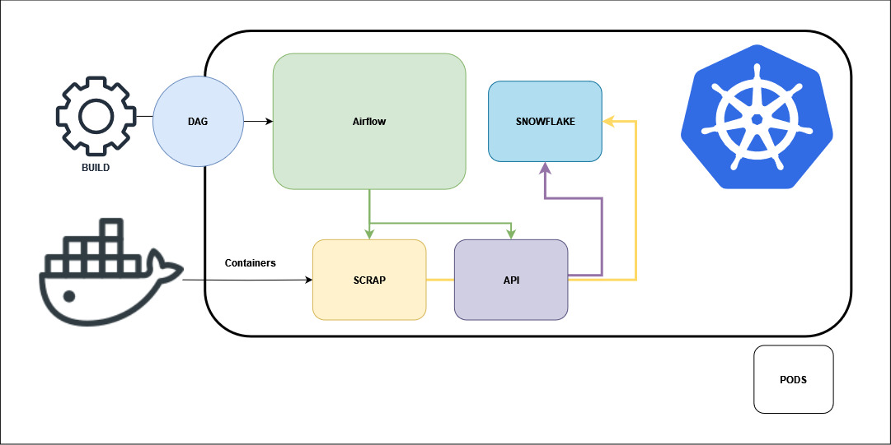

# Scrahp Project


## Table of Contents

- [Scrahp Project](#scrahp-project)
   - [Introduction](#introduction)
   - [Architecture](#architecture)
   - [Docker Usage](#docker-usage)
- [Discussions](#discussions)
   - [Setting Up in Production](#setting-up-in-production)
   - [Limitations of the Current Solution](#limitations-of-the-current-solution)
   - [Potential Improvements](#potential-improvements)
   - [Distributed Data Processing](#distributed-data-processing)


## Introduction

The Scrahp project is a web scraping and API implementation built with Scrapy and Flask. It provides a simple solution for extracting bbc articles and making it accessible via a user-friendly API.

## Architecture

The project consists of three main components that are containerized with **docker**:


1. **Scrahp (Scrapy Project):**
   - Handles web scraping and data extraction.
   - Utilizes ````Scrapy```` spiders to crawl the bbc website and collect information.

2. **API (Flask API):**
   - Exposes endpoints to interact with the scraped data.
   - Built with ````Flask```` for simplicity and ease of use.

3. **Database (SQLite3):**
   - Stores the scraped data in an ````SQLite```` database.
   - Ensures data persistence and easy retrieval.

## Project Setup

To get started with the Scrahp project follow these steps:

1. **Clone the project**:
   ```bash
    git clone https://github.com/HanyAkoury/scrahp.git
   ```

1. **Open the project folder**:
   ```bash
    cd scrahp
   ```

## Project Run (Docker)

### Overview
The Scrahp project is containerized using Docker, encompassing the three main components: the scraping application (`scrahp`), the API (`api`), and the database (`database`). This setup ensures consistent environments and easy deployment.

### Docker Compose Setup
- `docker-compose.yml` orchestrates the interaction between the three services, defining their dependencies, networking, and volume mappings.
- The services are:
  - `scrahp`: The scraping component, responsible for data collection.
  - `api`: A Python Flask API that interacts with the database and provides endpoints for data access or manipulation.
  - `database`: A lightweight Python-based database server, handling data storage and queries.


1. **Build the Services**:
   ```bash
   docker-compose -p scrahp-project build
   ```

2. **Start the Services**:
   ```bash
   docker-compose -p scrahp-project up
   ```

## Project Run (Local)

### Overview
Even though the Scrahp project is containerized using Docker you can run it on your local host machine.

### Requirements
- **Poetry**: Make sure you've installed [poetry](https://python-poetry.org/docs/) on your machine.

After you've installed poetry and added it to your environment variables path, please run the following commands.

1. **Poetry install dependencies**:
   ```bash
   poetry config virtualenvs.create true \
    && poetry install --no-dev --no-interaction --no-ansi
   ```

2. **Init the DB service**:
   *Go inside the db directory*
   ```bash
   cd db/ && poetry run python db_services.py
   ```
1. **Launch the crawler**:
   *Go back to the scrahp directory*
   ```bash
   cd ../ && poetry run scrapy crawl urls && poetry run scrapy crawl articles
   ```

2. **Launch the API**:
   *Go inside the db directory*
   ```bash
   poetry run python app.py
   ```


### Testing the API
#### Using ````curl````

When the docker-compose is up and running (or the API is manually running), you can test the API endpoints using `curl`. Below are some examples of interactions with the API `curl`:

1. **Fetching All Articles**:
   ```bash
   curl http://localhost:5000/articles
   ```

1. **Fetching a Specific Article**:

   Replace ARTICLE_URL with the actual URL of the article you want to fetch.
   ```bash
   curl http://localhost:5000/articles?url=ARTICLE_URL
   ```

1. **Getting Top 5 Authors**:
   ```bash
   curl http://localhost:5000/top_authors
   ```

#### Using a ````Web Browser````

Alternatively, you can test the API endpoints directly in your web browser by entering this on your browser: http://localhost:5000/

# Discussions
## Setting Up in Production

### Production Architecture


*A theoretical example of an architecture in a production setting/environment.*
- **Airflow on Kubernetes**: Manages and orchestrates web scraping tasks and data processing workflows within a Kubernetes cluster.
- **Datalake**: Any S3 like Datalake gen2 storage - saving raw files used when crawled websites for storage and historisation.
- **Dockerized Components**: Includes Flask API and Scrapy spiders, each running in separate Docker container managed by Kubernetes.
   - **Scrapy Spiders**: Perform web scraping, gathering data and storing it accordingly.
   - **Flask API**: Provides endpoints for data access and querying, interacting with Snowflake for data articles retrieval.
- **Snowflake Data Warehouse**: Central repository for storing processed data.
   - Data Schema (*for analytics*): Stores processed web scraping data.
   - Operational Schema (*for operations*): Manages application state and user data, functioning as the operational database within Snowflake.

### Production Deployment
To deploy this project in a production environment we should consider multiple aspects:
- Implement continuous integration and deployment (CI/CD) pipelines.
- Ensure code reviews are set in place for feature validation.
- Ensure logging and monitoring for real-time insights about the pipeline runs.

### Scalability and High Availability
- Use container orchestration tools like Kubernetes for scalability.
- Configure database replication and backups for high availability and data security.

## Limitations of the Current Solution

- **Specifics**: The current setup can't actually scrap the whole website, it's focused on the news section.
- **Scalability**: The current setup may not efficiently scale for very frequent scrapping, it's designed to run locally, one single code entrypoint.
- **Components**: Relying on SQLite is to say the least, the strict minimum for database interactions.
- **Robustness**: There are limited error handling or recovery mechanisms in the scraping process, cleaning can be better as well.


## Potential Improvements

### Using Alternative Technologies
- Adopt a distributed data processing framework like Spark for scalability.
- Utilize a more robust database system for enhanced performance and better analytics needs - Snowflake.
- Parallelize crawlers approach. Separate them into categories and based on the scheduler run several smaller crawler jobs.

### Architectural Patterns
- Implement a microservices architecture.
- Use message queues (e.g Kafka) for better handling of data flow and processing.

### Nice to have features
- Get new articles on website as event notifications to application (Slack, Teams etc.)
- Check for RSS feeds that hold maybe more articles to crawl.

## Advantages and Disadvantages of Distributed Data Processing

### Advantages
- **Scalability**: Easily scales to handle larger volumes of data and concurrent, more frequent requests.
- **Fault Tolerance**: Improved security and resiliance against failures and data loss.

### Disadvantages
- **Complexity**: Increased system complexity.
- **Resource Intensive**: Requires more infrastructure and resources to manage effectively and properly.
